.. globalindex::
   :maxdepth: 4
   
.. _Lumina Desktop Plugins:

Lumina Plugins
**************

Here's all the Lumina plugins, divided between desktop, menu, 
and panel plugins.

.. TODO: Add Screenshots and expanded descriptions to every plugin 
   entry. Example: :numref:`Figure %s: Placeholder <place1d>`

.. _desktop plugins:

Desktop Plugins
===============

These plugins are configured via this menu or that menu.

.. _Application Launcher:

Application Launcher
--------------------

info.ID = "applauncher"

.. _luminadesktopplugin1:

:numref:`Figure %s: Application Launcher <luminadesktopplugin1>` This 
icon is the result of using the Application Launcher to add a link to 
the "Lumina Desktop Information" application on the desktop.

Desktop button for launching an application.

.. _Audio Player:

Audio Player
------------

info.ID = "audioplayer"

.. _luminadesktopplugin2:

.. figure:: images/luminadesktopplugin2.png

:numref:`Figure %s: Audio Player <luminadesktopplugin2>` The Audio 
Player plugin will play user generated lists of audio files.

Play through lists of audio files.

.. _calendar:

Calendar
--------

info.ID = "calendar"

.. _luminadesktopplugin3:

.. figure:: images/luminadesktopplugin3.png

:numref:`Figure %s: Calendar <luminadesktopplugin3>` This is a calendar 
plugin 

Display a calendar on the desktop.

.. _Desktop Icons View:

Desktop Icons View
------------------

info.ID = "desktopview"

.. _luminadesktopplugin4:

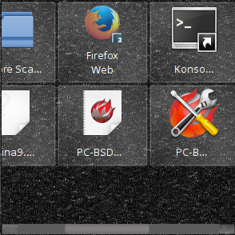

:numref:`Figure %s: Desktop Icons <luminadesktopplugin4>`

Area for automatically showing desktop icons.

.. _Note Pad:

Note Pad
--------

info.ID = "notepad"

.. _luminadesktopplugin5:

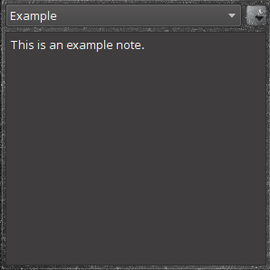

:numref:`Figure %s: Note Pad <luminadesktopplugin5>`

"Keep simple text notes on your desktop"

.. _RSS Reader:

RSS Reader
----------

info.ID = "rssreader"

.. _luminadesktopplugin6:

.. figure:: images/luminadesktopplugin6.png

:numref:`Figure %s: RSS Reader <luminadesktopplugin6>`

Monitor RSS Feeds (Requires internet connection).

.. _System Monitor:

System Monitor
--------------

info.ID = "systemmonitor"

.. _luminadesktopplugin7:

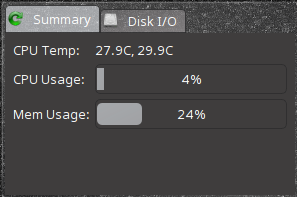

:numref:`Figure %s: System Monitor Display <luminadesktopplugin7>` Shows 
the "Summary" tab of the System Monitor plugin. CPU Temperature, CPU 
Usage, and Memory Usage are displayed.

.. _luminadesktopplugin8:

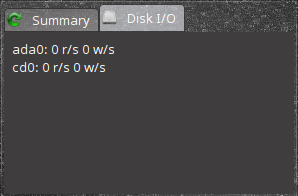

:numref:`Figure %s: System Monitor I/O <luminadesktopplugin8>` Shows 
the "Disk I/O" tab of the System Monitor plugin. Displayed are the 
current read and write speeds of the connected hardware, which in this 
case is hard drive and cd player. 

Keep track of system statistics such as CPU/Memory usage and CPU 
temperatures.

.. _menu plugins:

Menu Plugins
============

The right-click menu will always display the name of the current virtual
desktop at the top and the shutdown options on the bottom, as pictured 
in :numref:`Figure %s: Default Menu <luminamenuplugin1>`. The user can 
customize the rest of the menu at their leisure.

.. _luminamenuplugin1:

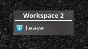

Right Click :menuselection:`Preferences --> Desktop --> Interface Configuration --> Context Menu and Plugins`

.. _Menu Applications:

Applications
------------

info.ID = "applications"

.. _luminamenuplugin2:

.. figure:: images/luminamenuplugin2.png

:numref:`Figure %s: Applications <luminamenuplugin2>`

Show the system applications menu.

.. _Custom App:

Custom App
----------

info.ID = "app"

.. _luminamenuplugin3:

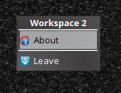

:numref:`Figure %s: Custom Application <luminamenuplugin3>`

Start a custom application.

.. _File Manager:

File Manager
------------

info.ID = "filemanager"

.. _luminamenuplugin4:

.. figure:: images/luminamenuplugin4.png

:numref:`Figure %s: File Manager <luminamenuplugin4>`

Browse the system with the default file manager.

.. _JSON Menu:

JSON Menu
---------

info.ID = "JSON Menu"

.. _luminamenuplugin5:

.. figure:: images/luminamenuplugin5.png

:numref:`Figure %s: JSON Menu Configuration <luminamenuplugin5>`

.. _luminamenuplugin6:

.. figure:: images/luminamenuplugin6.png

:numref:`Figure %s: JSON Menu Example <luminamenuplugin6>`

External script menu generation.

.. _Separator:

Separator
---------

info.ID = "line"

:numref:`Figure %s: Separator <luminamenuplugin1>`

Static horizontal line.

.. _Settings:

Preferences
-----------

info.ID = "Settings"

.. _luminamenuplugin7:

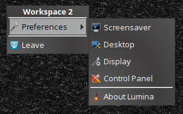

:numref:`Figure %s: Preferences <luminamenuplugin7>`

Show the desktop settings menu.

.. _Terminal:

Terminal
--------

info.ID = "terminal"

.. _luminamenuplugin8:

.. figure:: images/luminamenuplugin8.png

:numref:`Figure %s: Terminal <luminamenuplugin8>`

Start the default system terminal.

.. _Window List:

Window List
-----------

info.ID = "windowlist"

.. _luminamenuplugin9:

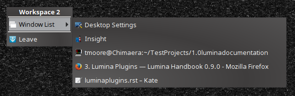

:numref:`Figure %s: Window List <luminamenuplugin9>`

List the open application windows.

.. _panel plugins:

Panel Plugins
=============

Panel plugins are useful and configurable. Here is a list of all 
available panel plugins:

.. _luminapanelplugin1:

.. figure:: images/luminapanelplugin1.png

:numref:`Figure %s: Panel Settings <luminapanelplugin1>`

.. _panel application launcher:

Panel Application Launcher
--------------------------

info.ID = "applauncher"

.. _luminapanelplugin2:

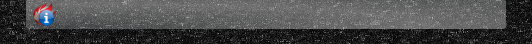

:numref:`Figure %s: Panel Application Launcher <luminapanelplugin2>`

When you select this plugin, it will prompt you to select the 
application to launch. This will add a shortcut for launching the 
selected application to the panel.

.. _Application Menu:

Application Menu
----------------

info.ID = "appmenu"

.. _luminapanelplugin3:

.. figure:: images/luminapanelplugin3.png

:numref:`Figure %s: Application Menu <luminapanelplugin3>`

Adds an application menu that contains a shortcut to your home directory,
a shortcut to the operating system’s graphical software management 
utility (if there is one), a shortcut to the operating system’s Control 
Panel (if it provides one), and a list of installed software sorted by 
categories.

.. _Battery Monitor:

Battery Monitor
---------------

info.ID = "battery"

Hover over this icon (not pictured) to view the current charge status of
the battery. When the charge reaches 15% or below, the low battery icon 
will flash intermittently and will change to a low battery icon when 
there is less than 5% charge left.

.. _Desktop Bar:

Desktop Bar
-----------

info.ID = "desktopbar"

.. _luminapanelplugin4:

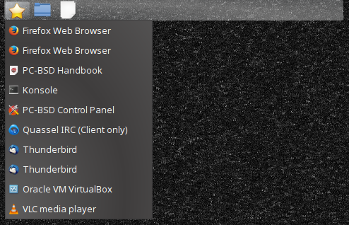

:numref:`Figure %s: Desktop Bar <luminapanelplugin4>`

Adds a “star” button for automatically displaying entries for anything
in the ~/Desktop folder and alternately launching the selected entry.

.. _Line:

Line
----

info.ID = "line"

.. _luminapanelplugin5:

.. figure:: images/luminapanelplugin5.png

:numref:`Figure %s: Line <luminapanelplugin5>`

Adds a separator line to the panel.

.. _Show Desktop:

Show Desktop
------------

info.ID = "homebutton"

.. _luminapanelplugin6:

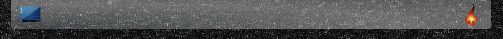

:numref:`Figure %s: Show Desktop Button <luminapanelplugin6>`

This button will hide all open windows so that only the desktop is visible.
This is useful for touch screens or small devices.

.. _Spacer:

Spacer
------

info.ID = "spacer"

.. _luminapanelplugin7:

.. figure:: images/luminapanelplugin7.png

:numref:`Figure %s: Spacer <luminapanelplugin7>`

Adds a blank area to the panel.

.. _Panel Start Menu:

Start Menu
----------

info.ID = "systemstart"

.. _luminapanelplugin8:

.. figure:: images/luminapanelplugin8.png

:numref:`Figure %s: Start Menu <luminapanelplugin8>`

Adds a classic start menu as seen on other operating systems.

.. _System Dashboard:

System Dashboard
----------------

info.ID = "systemdashboard"

.. _luminapanelplugin9:

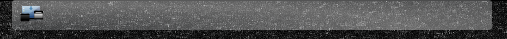

:numref:`Figure %s: System Dashboard <luminapanelplugin9>`

Used to view/modify audio volume, screen brightness, battery life, and 
virtual desktops.

.. _System Tray:

System Tray
-----------

info.ID = "systemtray"

Provides a display area for dockable applications.

.. _Task Manager (No Groups):

Task Manager (No Groups)
------------------------

info.ID = "taskmanager-nogroups"

.. _luminapanelplugin10:

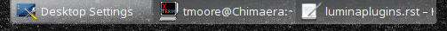

:numref:`Figure %s: Task Manager (No Groups) <luminapanelplugin10>`

Ensures that every window gets its own button. This uses a lot more space
on the panel since it needs to put part of the window title on each button.

.. _Task Manager:

Task Manager
------------

info.ID = "taskmanager"

.. _luminapanelplugin11:

.. figure:: images/luminapanelplugin11.png

:numref:`Figure %s: Task Manager <luminapanelplugin11>`

Added by default. Its behavior is to group windows by application.

.. _Time Date:

Time/Date
---------

info.ID = "clock"

.. _luminapanelplugin12:

.. figure:: images/luminapanelplugin12.png

:numref:`Figure %s: Time/Date <luminapanelplugin12>`

Displays the current time and date.

.. _User Button:

User Menu
---------

info.ID = "userbutton"

.. _luminapanelplugin13:

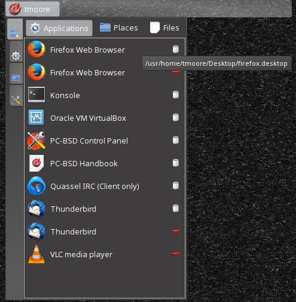

:numref:`Figure %s: User Menu 1 <luminapanelplugin13>`

.. _luminapanelplugin14:

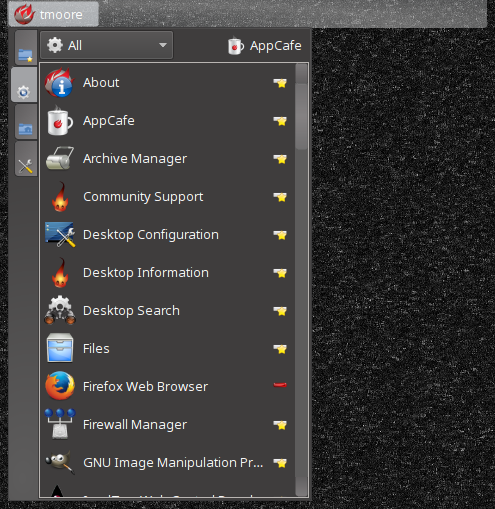

:numref:`Figure %s: User Menu 2 <luminapanelplugin14>`

.. _luminapanelplugin15:

.. figure:: images/luminapanelplugin15.png

:numref:`Figure %s: User Menu 3 <luminapanelplugin15>`

.. _luminapanelplugin16:

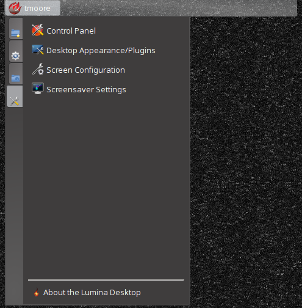

:numref:`Figure %s: User Menu 4 <luminapanelplugin16>`

.. _luminapanelplugin17:

.. figure:: images/luminapanelplugin17.png

:numref:`Figure %s: User Menu 5 <luminapanelplugin17>`

.. _luminapanelplugin18:

.. figure:: images/luminapanelplugin18.png

:numref:`Figure %s: User Menu 6 <luminapanelplugin18>`
Main button for accessing applications, directories, settings, and log 
out.

.. _Workspace Switcher:

Workspace Switcher
------------------

info.ID = "desktopswitcher"

.. _luminapanelplugin19:

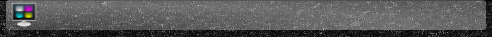

:numref:`Figure %s: Workspace Switcher <luminapanelplugin19>`

Used to switch between virtual desktops.
