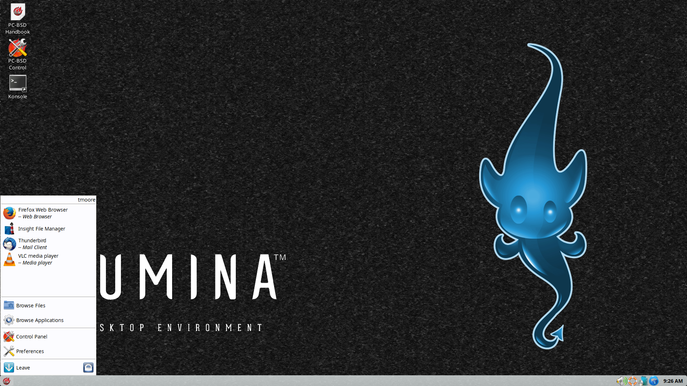

.. globalindex::
   :maxdepth: 4
   
.. _Test Introduction to Lumina:

Introduction to Lumina
**********************

The Lumina Desktop Environment (Lumina for short) is a lightweight, 
XDG-compliant, BSD-licensed desktop environment focused on streamlining 
work efficiency with minimal system overhead. It is specifically 
designed for TrueOS® and FreeBSD, but has also been ported to many other
BSD and Linux operating systems. It is based on the Qt graphical toolkit
and the Fluxbox window manager, and uses a small number of X utilities 
for various tasks, such as :command:`numlockx` and :command:`xscreensaver`.

Lumina's features include: 

* Very little system overhead.

* Does not require any of the desktop implementation frameworks such as 
  DBUS, policykit, consolekit, systemd, or HALD.

* Does not come bundled with any applications such as web browsers, 
  email clients, multimedia software, or office suites. Instead, it 
  provides utilities for configuring the desktop environment.

* Uses a simple, `text-based configuration file <https://github.com/pcbsd/lumina/blob/master/src-qt5/core/lumina-desktop/defaults/luminaDesktop.conf>`_
  for setting system-wide defaults. Lumina distributors can use this 
  file to easily preset the Lumina defaults and interface for their 
  distribution.

* Provides a plugin-based interface design. The user can make their 
  desktop as light or heavy as they wish by choosing which plugins to 
  have running on their desktop and panels. This plugin-based system is 
  similar to Android or other modern operating systems.
  
* A single, easy-to-use :ref:`Lumina Configuration` utility controls all 
  the different configuration options for the desktop in one location.

* Intelligent "favorites" system for creating quick shortcuts to 
  applications, files, and directories.

* ZFS file restore functionality through the :ref:`Insight File Manager`.

* Simple access to operating system-specific functionality such as 
  screen brightness, audio volume, and battery status.

* Multi-monitor support includes the :ref:`Lumina Xconfig` graphical 
  utility for adding or removing monitors from the Lumina session.

* Simple system controls through the system menu for configuring audio 
  volume, screen brightness, battery status/notifications, and workspace
  switching.

* Total system search capabilities through :ref:`Lumina Search`, without
  a daemon eating memory in the background.

* Screenshot functionality through :ref:`Lumina Screenshot`, which is 
  also tied to the “Print Screen” key by default.

.. _Test How to Get Lumina:

How to Get Lumina
=================

Lumina is available as a pre-built package for numerous operating 
systems. The `Get Lumina <http://lumina-desktop.org/get-lumina/>`_ 
section of the webpage includes installation instructions for each 
supported system.

In addition to pre-built packages, the 
`Lumina source repository <https://github.com/pcbsd/lumina>`_ 
is available on GitHub so that developers can contribute code or create
packages for other distributions. If you plan to compile Lumina from 
source, refer to `DEPENDENCIES <https://github.com/trueos/lumina/blob/master/DEPENDENCIES>`_ 
and ensure all dependent software is installed and to 
`README <https://github.com/trueos/lumina/blob/master/README.md>`_ for 
build instructions.

Once installed, add :command:`start-lumina-desktop` as the name of the 
binary in your :file:`.startx`, :file:`.xinitrc`, or similar X startup 
file.

.. note:: No startup configuration is needed when installed on a TrueOS®
          system as the PCDM login manager will automatically display 
          Lumina in the login menu. Simply log out, select Lumina,
          and log back in.
   
The rest of this Handbook describes the Lumina Configuration utility, 
other various utilities built into Lumina, and Lumina plugins. It then 
describes how you can contribute to the Lumina Project and lists the 
changelogs for each version of Lumina.

.. _Initial Settings:

Initial Settings
================

When freshly installed, Lumina will implement a number of default 
plugins and options for the user. All these first time defaults are 
configurable, with the numerous options covered in the 
:ref:`Lumina Desktop Plugins` section of the handbook.

.. note:: The screenshots used in the handbook are the defaults used by
          the Lumina Desktop Project. The default desktop appearance 
          can vary if using another distrubution's custom configuration
          of the Lumina Desktop Project.
  
:numref:`Figure %s: Lumina Desktop <lumina1d>` A screenshot of Lumina on
a TrueOS® system. The user has clicked the "fireball" icon in order to 
open the start menu.

.. _lumina1d:

   
The Start Menu provides quick access for user interaction with the 
system. The top frame is a quick search bar for rapidly finding specific 
items. Just underneath the search bar is a small field indicating which 
user is logged in. Also, If the system has a battery, you can hover over
the battery icon on the opposite side of the user name (not pictured) to
display the current status of the battery and the estimated time 
remaining if that battery is discharging. The remaining space of the 
start menu is divided into several categories:

* **Favorites:** This element is the largest section of the menu. Click 
  an entry to launch that application. Right-click an entry to "Remove 
  from Favorites" or to "Add to Quicklaunch". In Lumina, "Favorites"
  appear in this section of the start menu and "QuickLaunch" adds a 
  button for the application to the panel that is next to the start menu
  button.

* **Browse Files:** Used to browse for files and directories using the 
  :ref:`Insight File Manager`. One available action in this file manager
  is the ability to add a file or directory to the list of Favorites. 
  Simply select the file or directory and click the star icon in Insight.

* **Browse Applications:** Click this entry to browse all applications 
  currently registered on the system. Applications are listed 
  alphabetically by category and the "Show Categories" button has
  three modes. Click "Show Categories" to toggle between showing the 
  category names (white box icon), just the contents of the categories 
  (black box icon), or the categories and their contents (1/2 black, 
  1/2 white icon). Click an application's name to start the application.
  By right-clicking an application's name, you can select "Pin to
  Desktop", "Add to Favorites", or "Add to Quicklaunch". Using TrueOS® 
  or another operating system with a pre-defined application store will 
  add a "Manage Applications" button at the top of the applications list.
  Click it to open the specific operating system's application store. 
  For example, on a TrueOS® system, "Manage Applications" opens AppCafe®.
  Click the "Back" button to return to the start menu.

* **Control Panel:** If using TrueOS® or an operating system with
  a control panel, click this entry to open the operating system's 
  control panel.

* **Preferences:** Click this entry to access the following:

    * **Configure Desktop:** This entry opens the 
      :ref:`Lumina Configuration` utility.

    * **Lumina Desktop Information:** Click the "?" icon to determine 
      the installed version of Lumina.

    * **System Volume:** Use your mouse to move the volume control 
      slider to change the system audio volume from 0% to 100%. Click 
      the sound icon on the left to mute or unmute the speaker. If the 
      operating system provides a mixer utility, click the speaker icon 
      on the right to launch the mixer utility for advanced control of 
      the audio system.

    * **Screen Brightness:** Use the mouse to move the brightness 
      control slider from 10% to 100%.

    * **Workspace:** The number of available virtual workspaces are 
      listed. Click the right or left arrow to switch between workspaces.

    * **Locale:** This will only appear if the lumina-i18n package is 
      installed. The current locale will be displayed as the title of 
      the drop-down menu. Click the drop-down menu to select another 
      locale for this session. Refer to :ref:`User Settings` for more 
      information on fine-tuning the locale settings.

    * **Back:** Click to return to the start menu.
  
* **Leave:** Click this entry to view options to "Suspend System" (if 
  supported by the operating system, press the system's power button to 
  login and resume operation), "Restart System" (if the user has 
  permission), "Power Off System" (if the user has permission), "Sign 
  Out User", or press "Back" to return to the start menu. Alternately, 
  click the "lock" icon next to "Leave" to lock the system, returning to
  a login prompt.

.. note:: On a TrueOS system which is applying updates, the shutdown and
          restart options will be disabled until the updates are 
          complete, with a note indicating updates are in progress.

.. _Test Panel and System Tray:

Panel and System Tray
=====================

By default, Lumina provides a panel at the bottom of the screen with a 
system tray at the far right of the panel. This section describes the 
default layout. For instructions on how to configure the panel to suit 
your needs, refer to the "Panels" tab :ref:`Interface` section.
  
As you open windows or applications, a button will be added to the 
section of the panel near the start menu. If the application provides 
an icon, the button will appear as that icon and if you mouse over it, 
the tooltip will show the name of the application. If you have multiple 
copies of an application running, it will combine all those entries into
a single button and list the number of windows after the icon. If you 
click on a button, it will automatically make that window active and if 
you click it again, it will automatically minimize it. If there are 
multiple windows, you can select the particular window you want to 
activate from a drop-down menu.

If you right-click the title of an open window, a menu of options will 
appear so that you can shade, stick, maximize, iconify, raise, lower, 
set the window title, send the window to a workspace, layer/dock the 
window, set the window's transparency, remember a specified setting, or 
close the window.

The system tray is located in the right portion of the panel. Any 
applications that register a tray icon will appear in this area. For 
example, on a TrueOS system, icons will appear for Life Preserver, Mount
Tray, and SysAdm™. Click or right-click an icon to interact with 
that application directly. The current system time shown by the clock is
in the default format for the current locale. If you click the clock 
icon and then click "Time Zone", a menu will open where you can select 
to either "Use System Time" or click a country name in order to select a
city to change to that city's time zone.

.. index:: desktop context menu
.. _Desktop Context Menu:

Desktop Context Menu
====================

Right-clicking the desktop will open a menu of quick shortcuts and the 
title of the menu will indicate the name of the current workspace. This 
section describes the default menu items. For instructions on how to 
configure the right-click panel to suit your needs, refer to the 
:ref:`Interface` Configuration section of this handbook.

By default, the right-click menu contains the following items:

* **Terminal:** used to launch a system terminal. The default is 
  :command:`xterm`, but this can be customized.

* **Browse Files:** launches the default, and recommended, file manager,
  the :ref:`Insight File Manager`.

* **Applications:** provides shortcuts to the operating system's 
  graphical software management utility (if available), the control 
  panel (if the operating system provides one), and the applications 
  currently registered on the system, arranged by system category.

* **Preferences:** contains shortcuts to the screensaver preferences, 
  :ref:`Lumina Configuration` utility, display configuration 
  (:ref:`Lumina Xconfig`), the operating system's control panel, and for
  determining the version of Lumina.

* **Leave:** opens the system log out window, with options to log out of
  the desktop session, restart the system (if the user has permission), 
  shutdown the system (if the user has permission), cancel the log out 
  window, lock the system, or suspend the system (if the operating 
  system supports suspend mode).