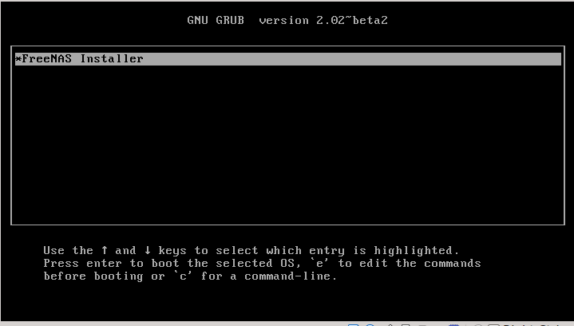

Level 1
*******

This document is meant to provide a generic framework for
testing custom .css formatting.

Level 2
=======

:numref:`Figure %s: Test Logo <trueoslogo>`

 TrueOS logo for testing.

.. _trueoslogo:

.. figure:: images/trueoslogo.png
   :scale: 100%

   A sample caption for the image. "A" is the first written character,
   all other figure name and number values are imported from <somewhere>.

:numref:`Figure %s <grub_menu_fig>`.

.. _grub_menu_fig:

   Grub Menu

Table test with numfig - numfig references should incorporate a
caption?

.. _table_test:

.. table:: Table Testing

   +---------------+-----------+----------------------------------------+
   | Parameter     |   Value   |   Description                          |
   |               |           |                                        |
   +===============+===========+========================================+
   | id            |           | Any unique value for the request,      |
   |               |           | including a hash, checksum, or uuid.   |
   +---------------+-----------+----------------------------------------+
   | name          | beadm     |                                        |
   |               |           |                                        |
   +---------------+-----------+----------------------------------------+
   | namespace     | sysadm    |                                        |
   |               |           |                                        |
   +---------------+-----------+----------------------------------------+
   | action        |           | Supported actions include "listbes",   |
   |               |           | "renamebe", "activatebe", "createbe",  |
   |               |           | "destroybe", "mountbe", and "umountbe" |
   +---------------+-----------+----------------------------------------+

Table test is presented on table :numref:`Table %s <table_test>`.

Level 3
---------

Directives:

:file:`testfile` with extra text for comparison.

:command:`testcommand` with extra text for comparison.

:kbd:`keystroke` with extra text for comparison.

:guilabel:`TestGuiLabel` with extra text for comparison.

:menuselection:`Click 1 --> Click 2` with extra text for comparison.

Experiment with monospace formats for file and command
directives.

.. note:: Testing formatting of notes.

.. tip:: Testing formatting of tips.

.. warning:: Testing formatting of warnings.

.. danger:: Testing formatting of danger tags.

Level 4
^^^^^^^

Testing special text characters and emphasis:

Testing **bold**.

Testing *italics*.

* Test list 1
* Test list 2
   
   * Test nesting list 1

* Test list 3

.. code-block:: none

 Testing a code block.
 
 Creating a large box for testing.

Lumina replace test:
|lumina| is x, y, and z.
 
Add additional themeing elements as they appear.

Warren's suggestions for themeing:

Blue link color is too light, low-contrast. 
trueos_style.css: 2076 - 2082: darkened with stronger blue.
added underline on hover.
Red clicked-link color is too light, low-contrast.
trueos_style.css: 2084 - 2086: darkened with strong red.
added underline on hover.

Borders on admonitions are too thick and too light.
note box: trueos_style.css 3859
tip box: 3867
warning box: 3855
danger box: 3850
Updated with new values:
border: 2px solid #8a8988;
border-radius: 5px

Main text in admonitions is light gray, low-contrast.
Add text colors to the lines used above ^
Add new value to above lines: color: #030303

Admonitions would look better with slightly radiused corners.
Added value to above lines: border-radius: 5px

Commands should use the same font typewriter font as filenames.
Already fixed - set to inconsolata: monospace + bolded.

Filename background are somewhat distracting and reduce contrast.
Maybe just use a different foreground color and no background?
#3681-3691: replaced padding to 1px, border-radius to 4px.
Altered background-color to #e6ede9 for very slight off white box to
emphasize the role command.

Remove either bold on menuselection, leave background color.
Deleted font-weight: 600 line and altered background color to #e8ede6

Reduce height of menuselection boxes to same as guilabel, maybe reduce
both, but make them the same. Same with :kbd:, reduce to same height as
others.
All boxes are have exactly the same values now, but :kbd: role has a
1 pixel solid black border to simulate the outline of a computer key.

Can the "view page source" links be removed?
Edited conf.py, uncomment html_show_sourcelink and set to False.

Make figure captions normal size font.
.css line #2173: change font-size to 100%
updated to sphinx 1.4.6 - this fixed numfig bug; numfig no longer needs
to be listed as a sphinx extension.

Make table titles and figure captions consistent?
(Both on top or on bottom, left- or center-justified)
trueos_style.css: #1945 - 1953. Copied values for figure captions.

Alter table header colors:
trueos_style.css: #3799
background-color: #bbeaf2

Add hover color change for table elements:
trueos_style.css: #2027-2044 - add :hover value and color #f2d8bb.

New feedback to incorporate post 9/1/16:
look at different colors for table headers and hover.

darken (or change tints) alternate rows in tables a little more.

make the text size in code blocks and lists exactly the same as the rest of the doc (small right now).

Confirm if table headers should be left justified or centered.

Use #8b0000  for the red and #0707ff  for the blue link colors.

Same size typewriter font for all these (same point size as normal font):
    :command:
    :file:
    :samp:

(command is good, code.file still does 95% in main text)

Table column headers like Description should be left-justified like table title and contents (also helps with finding them in wide browser windows)

Semicircle ends on search box make it kind of not look like a search box.  Maybe just reduce the rounding.

Font sizes in tables is reduced by one standard size.  No need for these to be smaller at all, just use the same size as main text.
